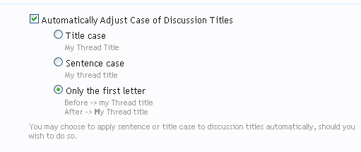

#[UcaseFirst](http://xenforo.com/community/resources/ucasefirst.84)  

This is an addon for the forum software XenForo. Adjust the thread title *automatically* only in the *first* letter of the thread title when creating a new thread. The difference between this and the `Sentence case` from XenForo, is that when using `Sentence case` option, it will lowercase all others words from the thread title.

To configure go to Options > Threads, Discussions and Conversations > Automatically Adjust Case of Discussion Titles as shown in the image:

Works on XenForo 1.2, 1.3, 1.4.

## 1.1.1
- Make use of event hints in code event listeners

## 1.1.0
- Fixed an error when trying to create a thread without title

## 1.0.0
- Released
